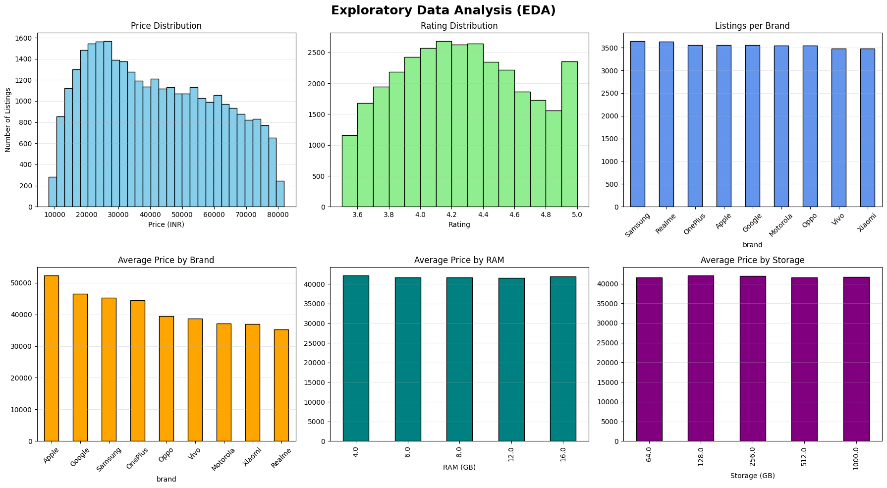
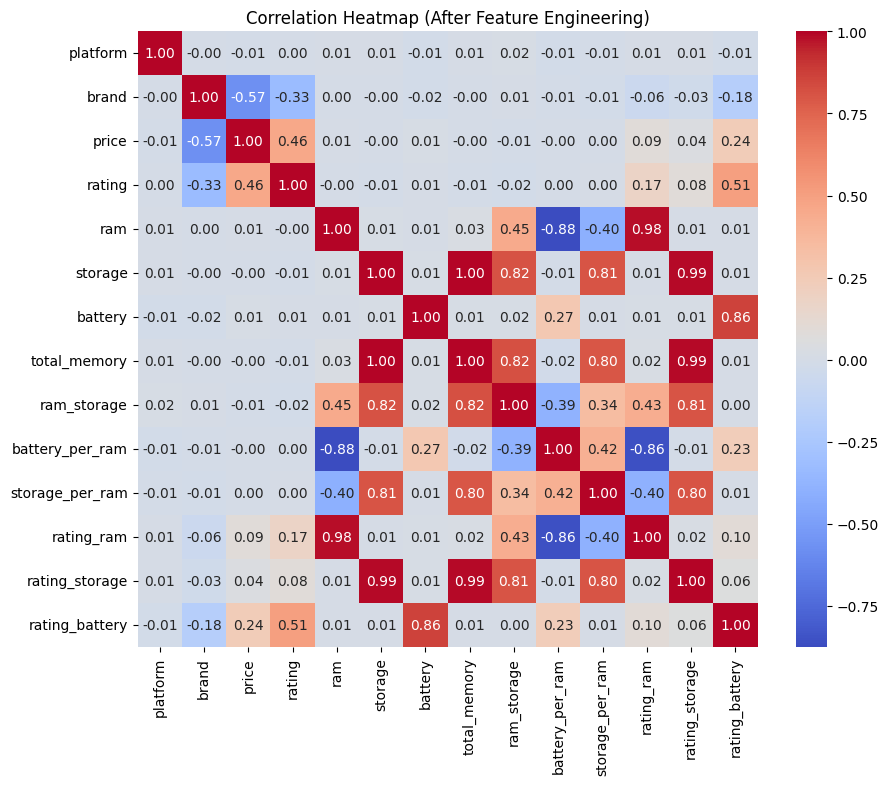
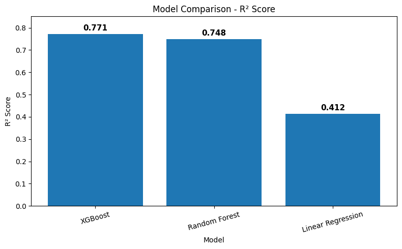
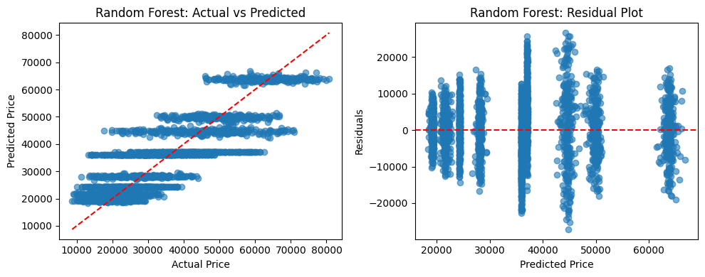
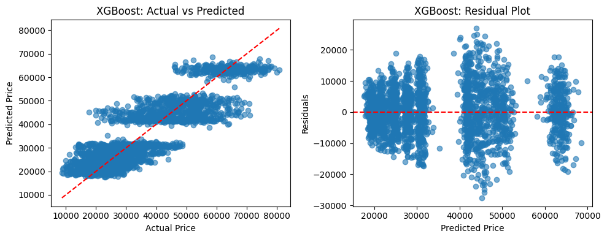
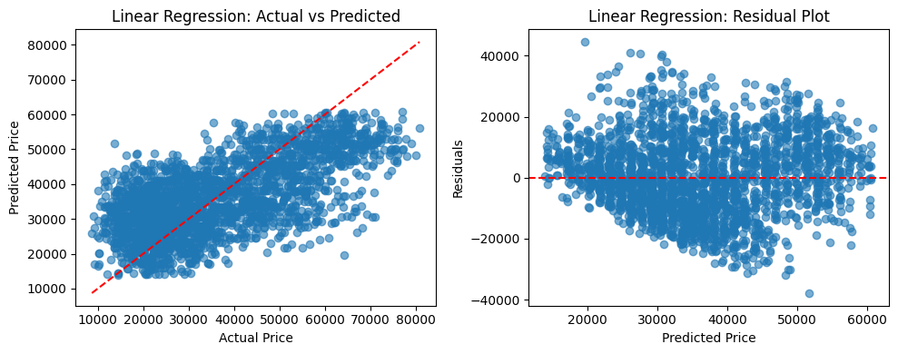
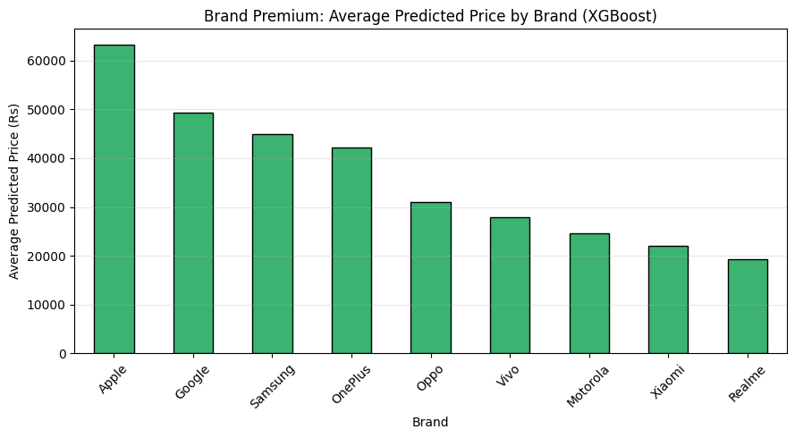
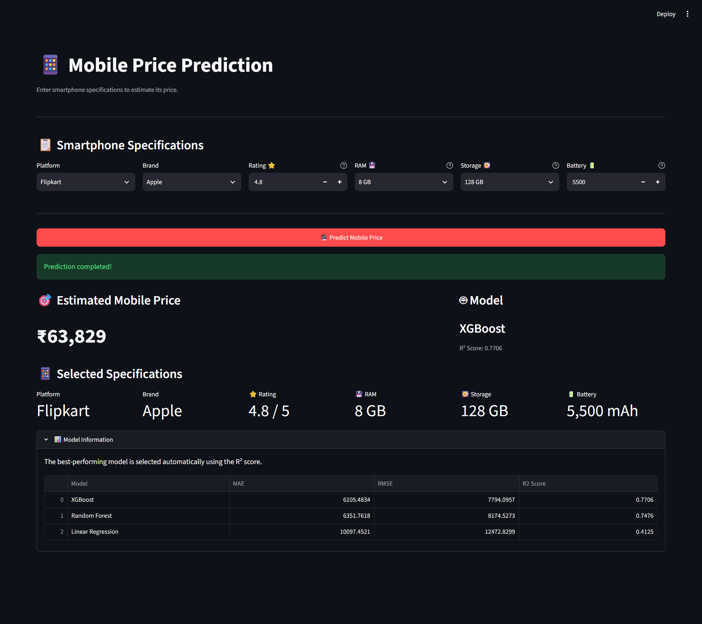

# 📱 Smartphone Price Prediction

<p align="center">


</p>

<p align="center">

<b>End-to-end machine learning regression project for predicting smartphone prices from technical specifications.</b>

</p>

---

## 📌 Project Overview

This project develops a machine learning regression system to estimate smartphone prices using product specifications such as:

- 📱 Brand
- ⭐ Rating
- 💾 RAM
- 💽 Storage
- 🔋 Battery capacity
- 🖥️ Platform

The project follows an end-to-end machine learning workflow:

**Data Exploration → Data Cleaning → Feature Engineering → Model Training → Model Evaluation → Model Comparison → Deployment**

The trained model is integrated into a **Streamlit web application**, allowing users to enter smartphone specifications and receive an estimated price.

---

## 🎯 Objective

The primary objective is to build a regression model capable of predicting smartphone prices from available technical specifications.

Three regression algorithms are evaluated:

1. Linear Regression
2. Random Forest
3. XGBoost

The models are compared using:

- MAE — Mean Absolute Error
- RMSE — Root Mean Squared Error
- R² Score

The best-performing model is selected based on the highest R² Score.

---

# 📊 Dataset

The dataset contains **32,000 smartphone listings** with **10 original columns**.

## Original Features

| Feature        | Description             |
| -------------- | ----------------------- |
| `platform`     | Smartphone platform     |
| `brand`        | Smartphone manufacturer |
| `product_name` | Product name            |
| `category`     | Product category        |
| `price`        | Target price in INR     |
| `rating`       | Product rating          |
| `ram`          | RAM specification       |
| `storage`      | Storage specification   |
| `battery`      | Battery capacity        |
| `url`          | Product listing URL     |

## Dataset Quality

| Property       |  Value |
| -------------- | -----: |
| Rows           | 32,000 |
| Columns        |     10 |
| Missing Values |      0 |
| Duplicate Rows |      0 |

---

# 🔎 Exploratory Data Analysis

The exploratory analysis investigates:

- Price distribution
- Rating distribution
- Smartphone listings by brand
- Average price by brand
- Average price by RAM
- Average price by storage
- Feature correlations
- Price outliers
- Repeated specifications with different prices

## 📊 EDA Overview

<table>
<tr>

<td width="50%">



</td>

<td width="50%">



</td>

</tr>
</table>

---

# ⚙️ Feature Engineering

Additional features were created to capture relationships between smartphone specifications.

### Engineered Features

| Feature           | Description      |
| ----------------- | ---------------- |
| `total_memory`    | RAM + Storage    |
| `ram_storage`     | RAM × Storage    |
| `battery_per_ram` | Battery / RAM    |
| `storage_per_ram` | Storage / RAM    |
| `rating_ram`      | Rating × RAM     |
| `rating_storage`  | Rating × Storage |
| `rating_battery`  | Rating × Battery |

These engineered features help the models capture interactions between hardware specifications and product ratings.

---

# 🤖 Machine Learning Models

Three regression models were trained and evaluated.

## 1. Linear Regression

Used as a baseline regression model to establish a simple linear relationship between the engineered features and smartphone price.

## 2. Random Forest

A tree-based ensemble model capable of capturing nonlinear relationships and feature interactions.

## 3. XGBoost

A gradient boosting model designed to capture complex nonlinear relationships and interactions between smartphone specifications.

---

# 📈 Model Performance

The models were evaluated using MAE, RMSE and R² Score.

### Model Comparison



### Performance Summary

| Model             |      MAE |     RMSE |   R² Score |
| ----------------- | -------: | -------: | ---------: |
| XGBoost           |  6105.48 |  7794.10 | **0.7706** |
| Random Forest     |  6351.76 |  8174.53 |     0.7476 |
| Linear Regression | 10097.45 | 12472.83 |     0.4125 |

### 🏆 Best Model: XGBoost

Based on the evaluation results, **XGBoost achieved the highest R² Score of 0.7706**, making it the best-performing model among the three evaluated approaches.

---

# 📊 Model Analysis

## 🌲 Random Forest



---

## 🚀 XGBoost



---

## 📉 Linear Regression



---

## 🏷️ Brand Premiumness



---

# 🌐 Streamlit Application

---

# 🌐 Streamlit Application

The trained machine learning model is deployed through an interactive Streamlit application.

Users can enter smartphone specifications including:

- 🖥️ Platform
- 📱 Brand
- ⭐ Rating
- 💾 RAM
- 💽 Storage
- 🔋 Battery

The application automatically processes the inputs using the same preprocessing and feature-engineering pipeline used during model training and generates an estimated smartphone price.

## 🖥️ Application Preview

<p align="center">



</p>

### Example Prediction

**Input:**

| Feature  | Value      |
| -------- | ---------- |
| Platform | Flipkart   |
| Brand    | Apple      |
| Rating   | ⭐ 4.8 / 5 |
| RAM      | 8 GB       |
| Storage  | 128 GB     |
| Battery  | 5,500 mAh  |

**Predicted Price: ₹63,829**

**Model:** XGBoost  
**R² Score:** 0.7706

---

### Example Input Constraints

| Feature | Available Values           |
| ------- | -------------------------- |
| Rating  | 0 – 5                      |
| RAM     | 2, 4, 8, 12, 16, 32 GB     |
| Storage | 64, 128, 256, 512 GB, 1 TB |
| Battery | 300 – 10,000 mAh           |

The application automatically selects the best-performing model based on the model comparison results.

---

# 🧠 Prediction Workflow

```text
User Input
    │
    ▼
Input Validation
    │
    ▼
Categorical Encoding
    │
    ▼
Feature Engineering
    │
    ├── total_memory
    ├── ram_storage
    ├── battery_per_ram
    ├── storage_per_ram
    ├── rating_ram
    ├── rating_storage
    └── rating_battery
    │
    ▼
Feature Alignment
    │
    ▼
Trained ML Model
    │
    ▼
Predicted Smartphone Price
```
